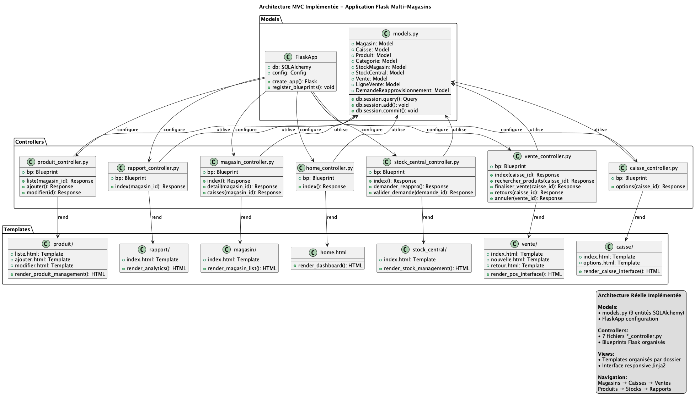
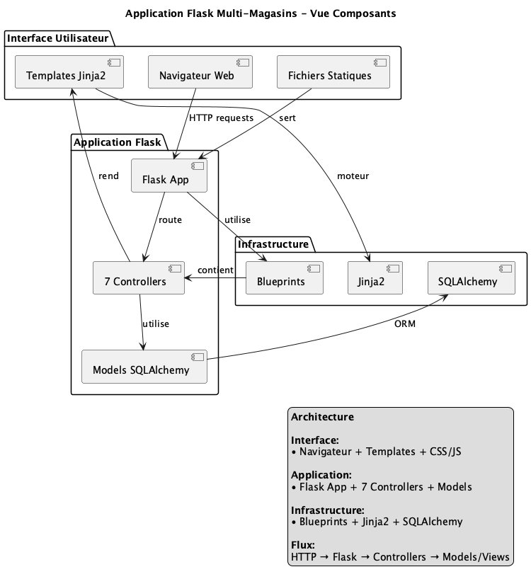
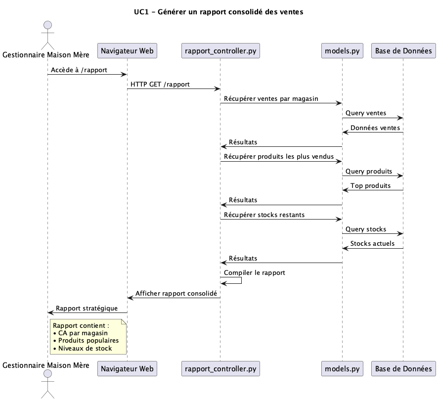
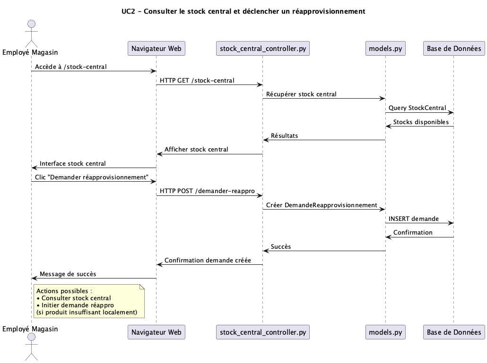
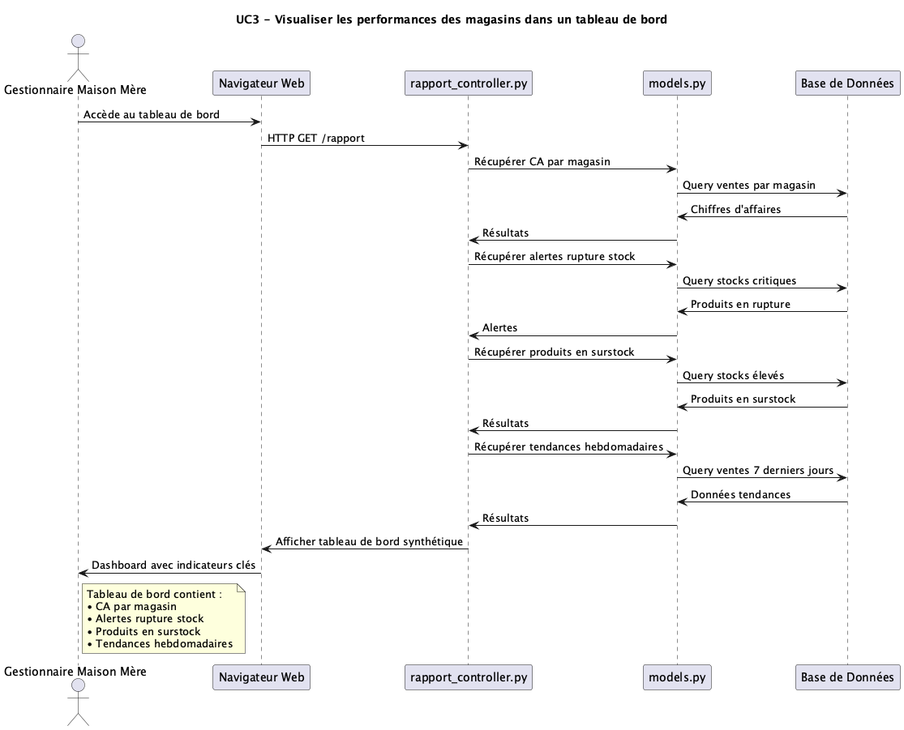
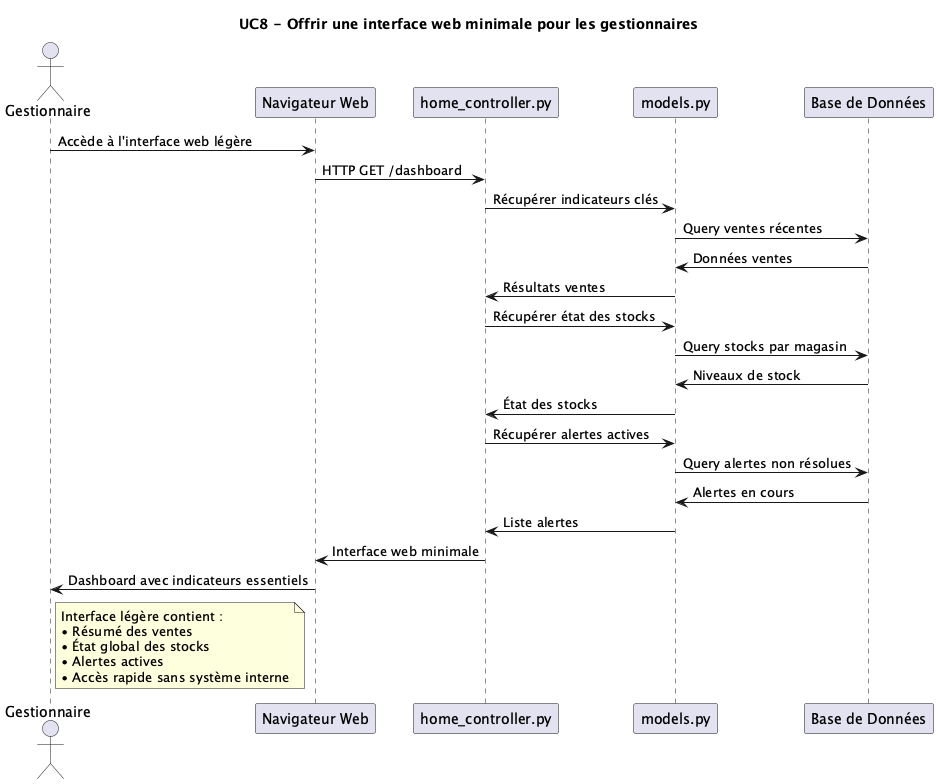
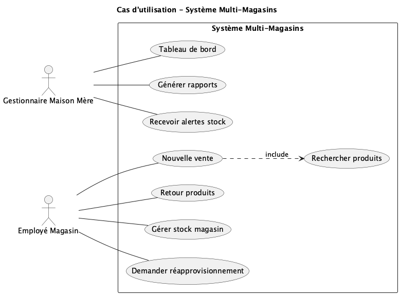
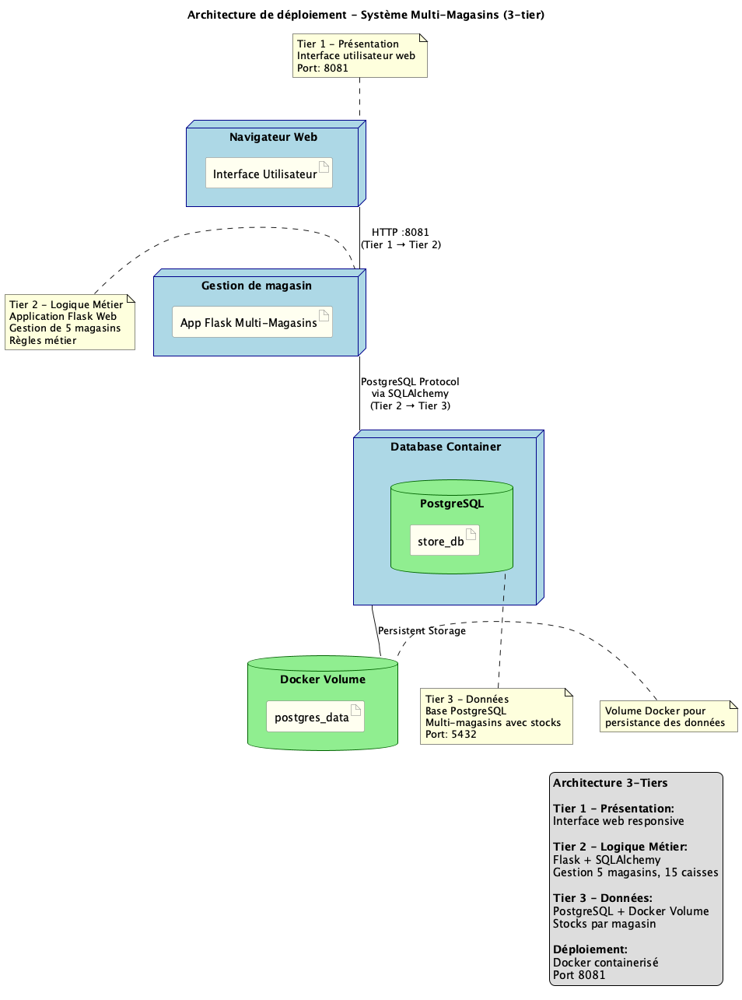

# Rapport Architecture ARC42 - Système Multi-Magasins
## Évolution Labs 0 à 2 - LOG430

**Auteur** : Louqman Masbahi  
**Date** : 09 juin 2025
**Version** : 1.0  
**Projet** : Système de Gestion Multi-Magasins  
**Github labo 0** : https://github.com/Louqman-ETS/log430-labo-0  
**Github labo 1** : https://github.com/Louqman-ETS/log430-labo-01  
**Github labo 2** : https://github.com/Louqman-ETS/log430-labo-01  


---

## 1. Introduction et Objectifs

### 1.1 Aperçu du Système

Ce rapport documente l'évolution architecturale d'un système de caisse simple (Lab 1) vers un système multi-magasins (Lab 2) capable de gérer 5 magasins avec 15 caisses.

### 1.2 Objectifs Architecturaux

**Objectifs Fonctionnels :**
- Centraliser la supervision de performance multi-magasins
- Avoir l'affichage du stock central et faire une demande de réaprovisionnement
- Fournir des rapports stratégiques consolidés
- Maintenir les opérations des magasins (ventes + retour)

**Objectifs Non-Fonctionnels :**
- **Scalabilité** : Support de nouveaux magasins sans refactoring majeur
- **Performance** : Temps de réponse pour les rapports
- **Disponibilité** : Si un problème survient l'application doit rester fonctionnelle
- **Maintenabilité** : Architecture MVC modulaire

### 1.3 Stakeholders

| Rôle | Responsabilités | Préoccupations |
|------|----------------|---------------|
| **Gestionnaire Maison Mère** | Supervision stratégique | Rapports consolidés, alertes |
| **Employé Magasin** | Opérations quotidiennes | Rapidité des ventes, stock local |
| **Équipe Développement** | Maintenance système | Évolutivité, dette technique |

---

## 2. Contraintes

### 2.1 Contraintes Techniques

- **Plateforme** : Applications web
- **Base de Données** : PostgreSQL pour la cohérence transactionnelle
- **Déploiement** : Containers Docker pour la portabilité
- **Langages** : il doit être flexible et pas trop lourd

### 2.2 Contraintes Organisationnelles

- **Coût** : Réutilisation maximale des composants existants
- **Temps** : Livraison en 3 phases (Lab 0 → Lab 2)

### 2.3 Contraintes Règlementaires

- **Comptabilité** : Traçabilité des transactions de vente

---

## 3. Contexte

### 3.1 Contexte Métier

**Domaine** : Commerce multi-emplacements  
**Modèle** : Magasins physiques avec supervision centralisée  
**Enjeux** : performance des points de vente

### 3.2 Évolution Lab 0 → Lab 2

#### Lab 0 : Mise en place d'un simple "Hello word"

- CI/CD
- test
- dockerfile
- deploiment de l'image

#### Lab 1 : Système de caisse console (2-tiers)
```
[app caisse console] ↔ [PostgreSQL Distant]
  Tier 1         Tier 2
```
- Architecture 2-tiers
- 3 caisses
- db initial

#### Lab 2 : Système Multi-Magasins Distribué (3-tiers)
```
[Navigateur] ↔ [Flask App] ↔ [PostgreSQL Distant]
    Tier 1       Tier 2         Tier 3
```
- Architecture 3-tiers
- 5 magasins, 15 caisses
- Rapports consolidés temps réel
- stock central avec demande de réaprovisionnement

### 3.3 Contraintes d'Évolution

**Éléments à Conserver :**
- Logique de vente existante (panier, calculs)
- Modèles de données de base (Produit, Vente)

**Éléments à Modifier :**
- Architecture de déploiement (local → containérisé)
- Gestion des stocks
- Reporting (inexistant → stratégique)

**Éléments à ajouter :**
- Structure MVC 
- Interface web

---

## 4. Stratégie de Solution

### 4.1 Approche Architecturale

**Principe Directeur** : *Modularity by Context*

Nous avons adopté une approche **Domain-Driven Design (DDD)** pour identifier les contextes métier distincts et organiser l'architecture en conséquence.

### 4.2 Patterns Architecturaux Appliqués

1. **MVC (Model-View-Controller)** : Séparation claire des responsabilités
2. **Repository Pattern** : Abstraction de l'accès aux données via SQLAlchemy
3. **Blueprint Pattern** : Modularisation des fonctionnalités Flask
4. **3-Tier Architecture** : Séparation présentation/logique/données

### 4.3 Analyse Domain-Driven Design

#### Identification des Sous-Domaines

**Référence** : Cette analyse DDD est reflétée dans la structure des diagrammes UML créés, notamment :
- **Diagramme de Classes** : Organisation MVC par domaines métier
- **Diagrammes de Séquence** : Interactions entre contextes métier

**1. Sous-Domaine Core : Ventes en Magasin**
```
Bounded Context: Point de Vente
- Entities: Vente, LigneVente, Caisse (cf. diagramme de classes)
- Controllers: vente_controller.py (cf. UC4, UC5 dans diagrammes de séquence)
- Templates: vente/ (interface de vente et retours)
```

**2. Sous-Domaine Support : Gestion Logistique**
```
Bounded Context: Gestion des Stocks
- Entities: Produit, StockMagasin (cf. diagramme de classes)
- Controllers: stock_central_controller.py (cf. UC2 dans diagramme de séquence)
- Templates: stock/ (consultation et réapprovisionnement)
```

**3. Sous-Domaine Generic : Supervision Maison Mère**
```
Bounded Context: Reporting & Analytics
- Controllers: rapport_controller.py (cf. UC1, UC3 dans diagrammes de séquence)  
- Templates: rapport/ (tableaux de bord et KPIs)
- Aggregation: Consolidation des données des autres contextes
```

#### Relations entre Contexts

Les relations sont documentées dans les diagrammes de séquence qui montrent :
- **UC1-UC3** : Le contexte Reporting interroge les autres contextes
- **UC2** : Le contexte Stock central fournit les données de réapprovisionnement

---

## 5. Vue des Blocs de Construction

### 5.1 Architecture MVC Complète

**Référence** : 


Ce diagramme présente la décomposition complète en 3 couches :

**Models (Couche Données)**
- 9 entités SQLAlchemy documentées dans le diagramme
- Relations entre Magasin, Caisse, Produit, Vente, StockMagasin
- Configuration FlaskApp avec pool de connexions

**Controllers (Couche Application)**
- 7 contrôleurs Flask avec leurs routes spécifiques
- Blueprints modulaires par domaine métier
- Validation et logique métier encapsulée

**Views (Couche Présentation)**
- Templates organisés par dossiers fonctionnels
- Héritage de templates avec layout commun
- Interface responsive Bootstrap

### 5.2 Vue Composants

**Référence** : 


Architecture simplifiée en 3 packages principaux :
- **Interface Utilisateur** : Templates, CSS, JavaScript
- **Application Flask** : Contrôleurs, Services, Configuration
- **Infrastructure** : Base de données, Models SQLAlchemy

Relations documentées entre les 9 composants identifiés.

---

## 6. Vue d'Exécution

### 6.1 Scénarios Cas d'Utilisation

Les scénarios d'exécution suivants sont documentés dans les diagrammes de séquence :

#### UC1 - Génération Rapport Consolidé
**Référence** :


Flux : Gestionnaire → rapport_controller.py → consultation rapport
- Récupération ventes par magasin
- Calcul des produits les plus vendus  
- Agrégation des stocks restants

#### UC2 - Gestion Stock & Réapprovisionnement  
**Référence** :


Flux : Employé → stock_central_controller.py → Consultation stock central
- Affichage stock central consolidé
- Demande de réapprovisionnement

#### UC3 - Tableau de Bord Performances
**Référence** : 


Flux : Gestionnaire → rapport_controller.py → Indicateurs clés
- Chiffre d'affaires par magasin
- Alertes de rupture de stock
- Tendances hebdomadaires

#### UC8 - Interface Web Minimale
**Référence** : 


Flux : Gestionnaire → home_controller.py → Dashboard léger
- Accès distant aux indicateurs essentiels
- Visibilité rapide sans système interne complexe

### 6.2 Cas d'Utilisation Métier

**Référence** : 


**2 acteurs principaux identifiés :**
- **Gestionnaire Maison Mère** : 3 cas d'usage (rapports, tableau de bord, interface web)
- **Employé Magasin** : 4 cas d'usage (ventes, retours, gestion stock, réapprovisionnement)

Total : **8 cas d'utilisation** essentiels couvrant toutes les fonctionnalités.

---

## 7. Vue de Déploiement

### 7.1 Architecture de Déploiement

**Référence** :


Ce diagramme présente l'architecture 3-tiers complète :

**Tier 1 - Présentation**
- Navigateur Web (client)
- Interface Bootstrap responsive
- JavaScript pour interactions dynamiques

**Tier 2 - Application** 
- Container Flask (Docker)
- Gestion de magasin
- Logique métier MVC

**Tier 3 - Données**
- PostgreSQL (serveur distant)
- Base de données relationnelle
- Gestion transactionnelle

### 7.2 Caractéristiques Techniques par Tier

**Référence** : voir sections 7.1

Le diagramme documente :
- Spécifications techniques de chaque nœud
- Protocoles de communication (HTTP, TCP/IP)
- Légende organisée par tiers architectural

---

## 8. Concepts Transversaux

### 8.1 Sécurité

**Authentification :** Non implémentée 
**Données :** Validation côté serveur, échappement SQL via ORM

### 8.2 Performance

**Optimisations Appliquées :**
- Connection pooling (5 connexions)

### 8.3 Observabilité

**Logging :** Flask logging configuré
**Monitoring :** Docker logs via `docker-compose logs`
**Alerting :** Alertes métier (ruptures stock) dans l'UI

### 8.4 Gestion des Erreurs

```python
# Pattern appliqué
@app.errorhandler(SQLAlchemyError)
def handle_db_error(error):
    db.session.rollback()
    return render_template('error.html', 
                         message="Erreur base de données"), 500
```

---

## 9. Décisions

### 9.1 Architectural Decision Records (ADR)

#### ADR-001 : Architecture 2-Tier avec PostgreSQL (Labo 1)
**Status** : Accepted  
**Context** : Gestion persistante des données avec séparation logique métier/stockage  
**Decision** : Architecture 2-tier client Python console + serveur PostgreSQL  
**Consequences** :
- Séparation claire des responsabilités
- PostgreSQL : transactions, contraintes, robustesse
- Déploiement facilité avec Docker
- Gestion concurrence des données
- Support transactions concurrentes  
- Dépendance PostgreSQL et connexion réseau
- Configuration initiale plus complexe
- Gestion migrations base de données

#### ADR-002 : Utilisation SQLAlchemy comme ORM (Labo 1)
**Status** : Accepted  
**Context** : Interface efficace et sécurisée avec PostgreSQL  
**Decision** : Adopter SQLAlchemy 2.0+ comme ORM principal  
**Consequences** :
- Abstraction base de données avec modèles Python
- Protection automatique injections SQL  
- Gestion automatique pool de connexions
- Facilité de test avec sessions de test
- Code maintenable et robuste
- Légère surcharge performance vs SQL brut
- Complexité accrue pour requêtes très complexes
- Dépendance supplémentaire dans le projet

#### ADR-003 : Adoption de Flask comme Framework Web (Labo 2)
**Status** : Accepted  
**Context** : Transition de l'application console vers interface web multi-utilisateurs  
**Decision** : Adopter Flask comme framework web principal  
**Consequences** :
- Interface web accessible via navigateur standard
- Multi-utilisateurs : plusieurs caisses simultanément  
- Architecture modulaire avec blueprints
- Intégration native SQLAlchemy + Jinja2 + Bootstrap
- Déploiement simplifié avec Docker
- Maintenance facilitée par structure MVC claire
- Complexité accrue vs application console simple
- Gestion sécurité web requise

#### ADR-004 : Adoption Architecture MVC (Labo 2)
**Status** : Accepted  
**Context** : Organisation structurée du code Flask pour maintenabilité  
**Decision** : Implémenter architecture MVC complète  
**Consequences** :
- Model : 9 entités SQLAlchemy dans `models.py`
- View : Templates Jinja2 organisés par modules  
- Controller : 7 blueprints Flask spécialisés
- Séparation claire des responsabilités
- Maintenabilité et évolutivité améliorées
- Testabilité de chaque couche indépendamment
- Réutilisabilité des composants (templates, modèles)
- Complexité initiale plus élevée
- Courbe d'apprentissage pour l'organisation MVC

### 9.2 Alternatives Écartées

**NoSQL :** Besoin de cohérence transactionnelle forte

---

## 10. Scénarios de Qualité

### 10.1 Modifiabilité

**Scenario 1**
- **Source** :  Développeur
- **Stimulus** : Ajout nouveau type de rapport
- **Environment** : Code en production
- **Response** : Nouveau module déployé
- **Measure** : 4 heures de développement

**Architecture Response** :
- Architecture MVC modulaire
- Blueprints Flask isolés
- Templates réutilisables

---

## 11. Risques et Dette Technique

### 11.1 Risques Techniques Identifiés

#### RISK-001 : Performance Dégradée (Croissance Données)
**Probabilité :** Haute  
**Impact :** Moyen  
**Mitigation :**
- Archivage des anciennes ventes
- Cache applicatif pour KPIs

#### RISK-003 : Sécurité (Absence d'Authentification)
**Probabilité :** Haute  
**Impact :** Moyen  
**Mitigation :**
- Plan d'implémentation auth future

### 11.2 Dette Technique

#### DEBT-001 : Absence de Tests Automatisés Complets
**Urgence** : Moyenne  
**Effort** : 2 jours  
**Description** : Tests unitaires limités
**Impact** : Régression difficile à détecter

#### DEBT-002 : Gestion d'Erreurs Incomplète
**Urgence** : Moyenne  
**Effort** : 1 jours  
**Description** : Pas tous les cas d'erreur gérés proprement  
**Impact** : Expérience utilisateur dégradée

---

## 12. Glossaire

### Termes Métier

**Caisse** : Terminal de vente associé à un magasin  
**Chiffre d'Affaires (CA)** : Montant total des ventes sur une période  
**KPI** : Key Performance Indicator, indicateur de performance  
**Magasin** : Point de vente physique avec plusieurs caisses  
**Panier Moyen** : CA total / Nombre de transactions  
**Réapprovisionnement** : Commande de stock supplémentaire  
**Rupture de Stock** : Quantité = 0 pour un produit  
**Seuil d'Alerte** : Niveau de stock déclenchant une alerte  
**Ticket Moyen** : Valeur moyenne d'une transaction

### Termes Techniques

**Blueprint** : Module Flask pour organiser les routes  
**MVC** : Model-View-Controller, pattern architectural  
**ORM** : Object-Relational Mapping (SQLAlchemy)  
**Pool de Connexions** : Gestion optimisée des connexions DB  
**CRUD** : Create, Read, Update, Delete operations  
**3-Tier** : Architecture à 3 niveaux (présentation/logique/données)

### Acronymes

**ADR** : Architectural Decision Record  
**API** : Application Programming Interface  
**DDD** : Domain-Driven Design  
**QAS** : Quality Attribute Scenario  
**RGPD** : Règlement Général sur la Protection des Données  
**SQL** : Structured Query Language  
**TTC** : Toutes Taxes Comprises  
**UI** : User Interface

---

## Conclusion

Ce rapport documente la transformation réussie d'un système de caisse simple vers une architecture multi-magasins scalable. L'approche Domain-Driven Design a permis d'identifier clairement les contextes métier et de structurer l'architecture en conséquence.